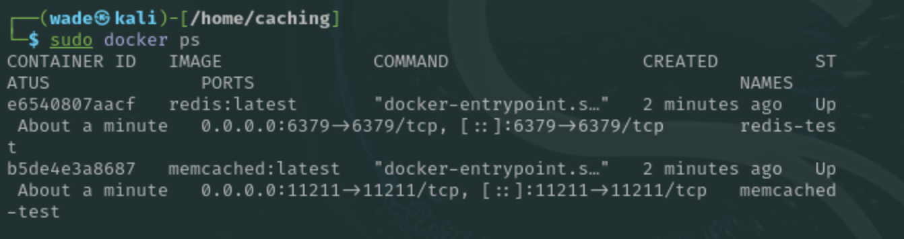
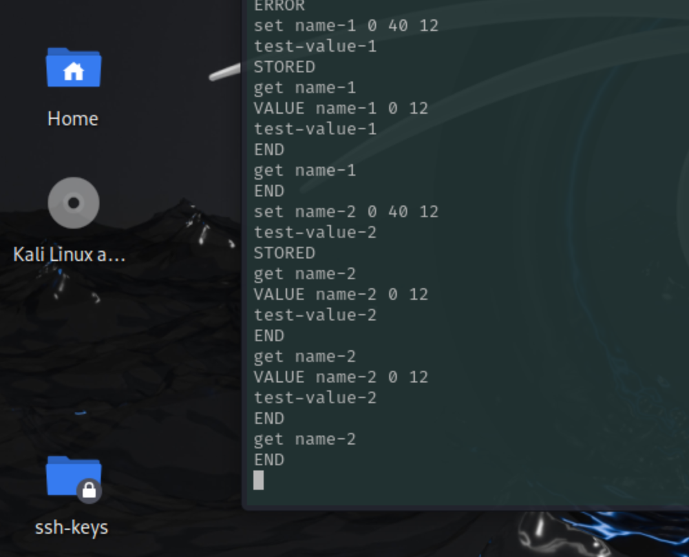
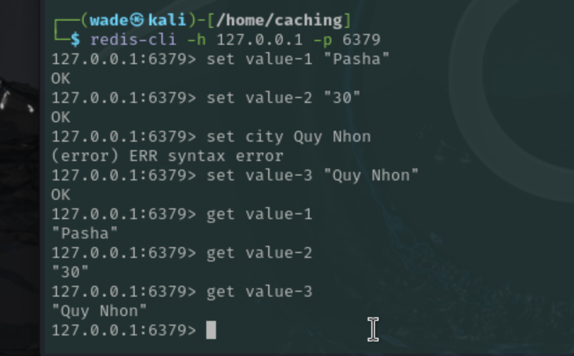
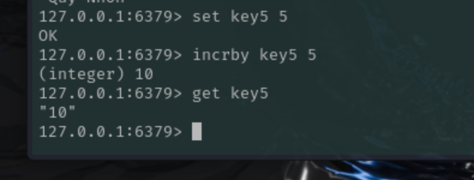

# Домашнее задание к занятию "`Кеширование Redis/memcached`" - `Решетов Павел`

---

### Задание 1. Кеширование

`Приведите примеры проблем, которые может решить кеширование.Приведите ответ в свободной форме........`

 `Ответ: Ускоряет работу приложения. Уменьшает нагрузку на сервер, откуда берутся данные. Также с ним проще масштабировать систему.`

---

### Задание 2. Memcached

`Установите и запустите memcached. Приведите скриншот systemctl status memcached, где будет видно, что memcached запущен.`

`Ответ:`

---

### Задание 3. Удаление по TTL в Memcached

`Запишите в memcached несколько ключей с любыми именами и значениями, для которых выставлен TTL 5.`

`Ответ: поставил 40 сек, за 5 не успевал проверять`

### Задание 4. Запись данных в Redis

`Запишите в Redis несколько ключей с любыми именами и значениями.Через redis-cli достаньте все записанные ключи и значения из базы, приведите скриншот этой операции.`

`Ответ:`

### Задание 5. Работа с числами

`Запишите в Redis ключ key5 со значением типа "int" равным числу 5. Увеличьте его на 5, чтобы в итоге в значении лежало число 10.Приведите скриншот, где будут проделаны все операции и будет видно, что значение key5 стало равно 10.`

`Ответ:`

